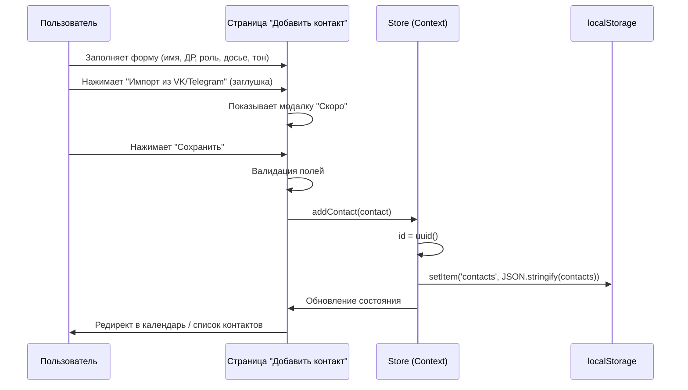
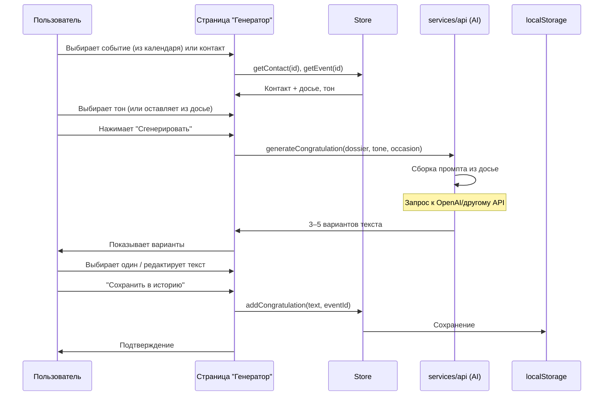
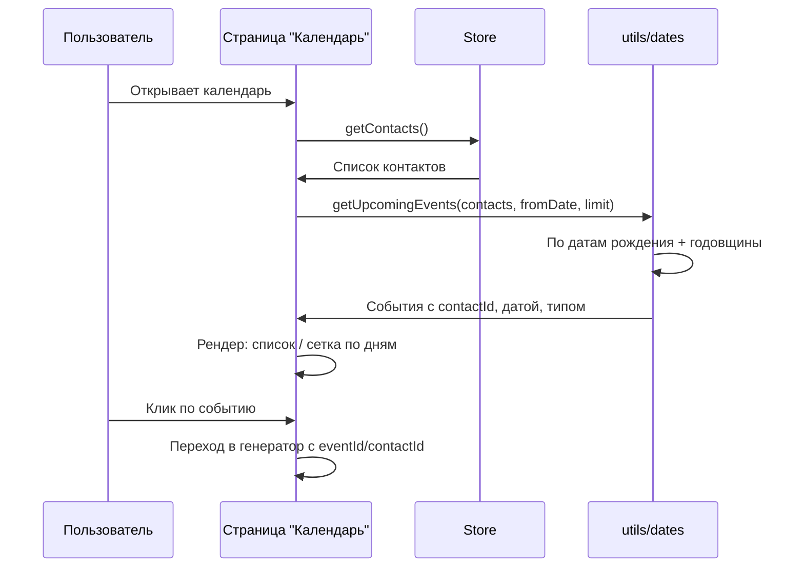
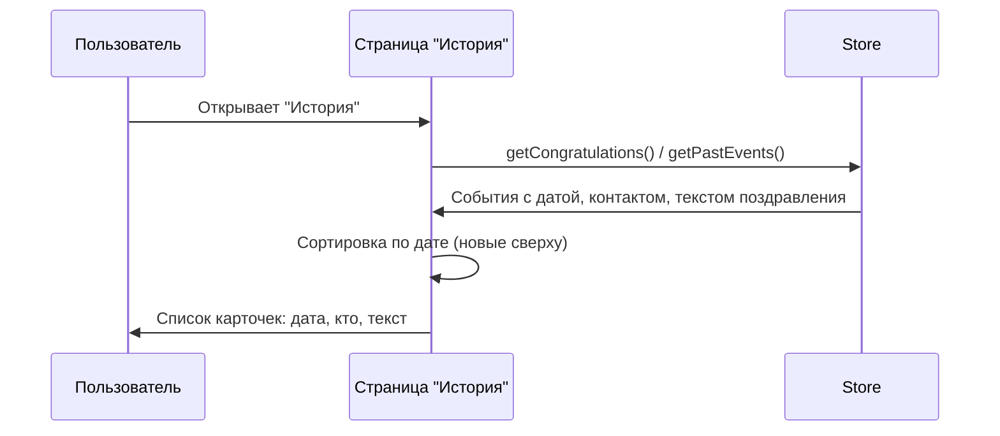

# План разработки «Поздравлятор+» (MVP)

Пошаговый план с командами для Cursor. Копируй блоки в чат Cursor по порядку.

---

## Часть 0: Что уже сделано

- Проект `pozdravlyator/` на Vite + React 19.
- План и диаграммы в этом файле.
- Структура папок и код MVP созданы: константы, хранилище, контекст, страницы (досье, календарь, генератор, история), роутинг, нижняя навигация, PWA manifest, адаптивные стили.

**Запуск приложения:**

```bash
cd /Users/user/Desktop/birthday-bot/pozdravlyator && npm run dev
```

Открой в браузере адрес, который покажет Vite (обычно http://localhost:5173).

---

## Часть 1: Установка зависимостей

**Команда для терминала (выполни один раз):**

```bash
cd /Users/user/Desktop/birthday-bot/pozdravlyator && npm install
```

(В `package.json` уже добавлены: `react-router-dom`, `date-fns`, `uuid`.)

**Команда для Cursor (если нужны типы):**

```
Добавь в devDependencies: @types/uuid. В package.json уже есть react-router-dom, date-fns, uuid.
```

---

## Часть 2: Структура папок и модели данных

**Команда для Cursor:**

```
В папке pozdravlyator/src создай:
- components/ — переиспользуемые компоненты (Button, Card, Input, NavBar).
- pages/ — страницы: AddContact, Calendar, Generator, History.
- store/ — контекст или простой store для контактов и событий (localStorage).
- services/ — api.js (вызов ИИ), storage.js (работа с localStorage).
- hooks/ — useContacts, useEvents.
- constants/ — TONES (тона поздравлений), ROLES (роли контактов).
- utils/ — formatDate, getUpcomingEvents.
- data/ — типы/схемы: контакт (имя, дата рождения, роль, досье, тон), событие (дата, тип, contactId), поздравление (текст, тон, eventId).
Не создавай пока пустые файлы — только перечисли, что в какой папке будет. Потом создадим содержимое.
```

После этого создаются файлы с кодом (см. раздел «Код» ниже).

---

## Часть 3: Сиквенс-диаграммы (Mermaid)

Диаграммы лежат в репозитории: `docs/sequences/`. Ниже — текст для копирования.

### 3.1 Добавление контакта (досье)

**Файл:** `docs/sequences/01-add-contact.md`



### 3.2 Генерация поздравления

**Файл:** `docs/sequences/02-generate-congratulation.md`



### 3.3 Календарь и предстоящие события

**Файл:** `docs/sequences/03-calendar-upcoming.md`



### 3.4 История прошедших событий

**Файл:** `docs/sequences/04-history.md`



---

## Часть 4: Пошаговые команды для Cursor (копируй по одной)

Выполняй по порядку. Каждый блок — одна команда в чат Cursor.

**Шаг 4.1 — Константы**

```
В pozdravlyator/src/constants/ создай:
- tones.js: массив { id, name } для тонов: трогательный, ироничный, официальный, эпичный.
- roles.js: массив { id, name } для ролей: мама, друг, коллега, партнёр, свой вариант.
```

**Шаг 4.2 — Утилиты дат**

```
В pozdravlyator/src/utils/ создай:
- dateUtils.js: getUpcomingEvents(contacts, fromDate, limit) — по датам рождения возвращает события на ближайшие 30 дней; каждый объект: { id, contactId, date, type: 'birthday', contact }.
- formatDate(date) для отображения.
```

**Шаг 4.3 — Хранилище**

```
В pozdravlyator/src/services/storage.js реализуй:
- loadContacts(), saveContacts(contacts)
- loadCongratulations(), saveCongratulations(items)
Всё через localStorage, ключи 'pozdrav_contacts', 'pozdrav_congratulations'.
```

**Шаг 4.4 — Store (Context)**

```
В pozdravlyator/src/store/ создай AppContext с:
- contacts, setContacts (из storage при инициализации)
- congratulations, setCongratulations
- addContact(contact), updateContact(id, data), deleteContact(id)
- addCongratulation(item), getCongratulationsByEvent(eventId)
Оберни приложение в AppProvider в main.jsx.
```

**Шаг 4.5 — API для ИИ**

```
В pozdravlyator/src/services/api.js создай функцию generateCongratulation(dossier, tone, occasion).
Она формирует промпт из полей досье (имя, роль, хобби, шутки и т.д.) и тона, вызывает fetch на /api/generate или внешний API (заглушка: возвращает массив из 3 фраз-заглушек).
Добавь в .env.example переменную VITE_AI_API_URL.
```

**Шаг 4.6 — Страница «Добавить контакт»**

```
В pozdravlyator/src/pages/AddContact.jsx сделай форму:
- Имя, дата рождения, роль (select из constants/roles), тон по умолчанию (select из constants/tones).
- Досье: хобби, мечты, шутки, воспоминания, музыка/кино/книги (textarea или несколько полей).
- Кнопки: «Импорт из VK» / «Импорт из Telegram» — пока модалка «Скоро».
- Submit — вызов addContact из контекста, редирект на календарь или список контактов.
Mobile-first, адаптивно.
```

**Шаг 4.7 — Страница «Календарь / Предстоящие события»**

```
В pozdravlyator/src/pages/Calendar.jsx:
- Используй getUpcomingEvents из utils, данные контактов из контекста.
- Покажи список предстоящих событий (дата, имя, тип). Клик по событию — переход на страницу генератора с state: { eventId, contactId }.
- Можно разбить по неделям или по дням. Mobile-first.
```

**Шаг 4.8 — Страница «Генератор поздравлений»**

```
В pozdravlyator/src/pages/Generator.jsx:
- Принимай из location.state eventId/contactId или выбери контакт из списка.
- Покажи досье контакта и выбор тона. Кнопка «Сгенерировать» — вызов generateCongratulation, отображение 3–5 вариантов.
- Редактирование текста в textarea. Кнопка «Сохранить в историю» — addCongratulation, переход в историю или календарь.
```

**Шаг 4.9 — Страница «История»**

```
В pozdravlyator/src/pages/History.jsx:
- Список сохранённых поздравлений из контекста (getCongratulations или прошлые события с привязанными поздравлениями).
- Карточки: дата, имя контакта, текст. Сортировка по дате. Адаптивная сетка.
```

**Шаг 4.10 — Роутинг и навигация**

```
В pozdravlyator/src/App.jsx настрой react-router-dom:
- / — редирект на /calendar или главная-дашборд с блоками «Календарь», «Добавить контакт», «История».
- /contacts/add — AddContact
- /calendar — Calendar
- /generate — Generator (state для event/contact)
- /history — History
Добавь нижнюю навигацию (mobile): Календарь, Добавить, История. Или общий NavBar с ссылками.
```

**Шаг 4.11 — PWA**

```
Добавь в pozdravlyator: manifest.json (name, short_name, start_url, display standalone, иконки), в index.html ссылку на manifest. Подключи vite-plugin-pwa и сгенерируй service worker для офлайн-кэша статики (по желанию — офлайн-страница).
```

**Шаг 4.12 — Стили и адаптив**

```
Сделай mobile-first: базовые стили в index.css (CSS variables для цветов и отступов), общие компоненты Button, Card, Input в components/. Убедись, что все страницы читаемы и кнопки удобны на 320px и выше.
```

---

## Часть 5: Переменные окружения

В `pozdravlyator/` уже есть `.env.example` (или создай вручную):

```
VITE_AI_API_URL=https://your-api.com/generate
```

Скопируй в `.env` и при подключении бэкенда/ИИ пропиши реальный URL.

---

## Часть 6: Чек-лист MVP

- [ ] Установлены зависимости: react-router-dom, date-fns, uuid
- [ ] Константы тонов и ролей
- [ ] Утилиты дат и getUpcomingEvents
- [ ] storage.js + AppContext с контактами и поздравлениями
- [ ] api.js с заглушкой generateCongratulation
- [ ] Страница добавления контакта (досье) с заглушками VK/Telegram
- [ ] Страница календаря / предстоящих событий
- [ ] Страница генератора с выбором тона и сохранением в историю
- [ ] Страница истории
- [ ] Роутинг и нижняя навигация
- [ ] PWA: manifest + service worker (опционально)
- [ ] Адаптивная вёрстка (mobile-first)

---

## Часть 7: Интеграции (после MVP)

- **VK:** OAuth, API друзей с датами рождения (документация VK API).
- **Telegram:** Bot API или Telegram Login Widget — получение id/username; даты рождения в VK или ввод вручную.
- **Календарь телефона:** позже — через Web API или нативное приложение.

Команда для Cursor при добавлении VK:

```
Добавь на страницу AddContact кнопку «Импорт из VK»: OAuth, затем запрос к API friends.get с fields=bdate. После авторизации заполни список контактов с датами и дай пользователю выбрать, кого добавить в досье.
```

---

## Итог

1. Выполни **Часть 1** (npm install) в терминале.
2. Создай папки из **Части 2** (или доверь реализации кода ниже).
3. Сохрани **Часть 3** в `docs/sequences/*.md` для сиквенсов.
4. Выполняй **Часть 4** по шагам 4.1–4.12 в Cursor.
5. Настрой **Часть 5** (.env).
6. Проверь **Часть 6** перед релизом MVP.

После этого у тебя будет рабочий MVP с календарём, досье, генератором (с заглушкой ИИ) и историей, готовый к подключению реального API и импорта из VK/Telegram.
