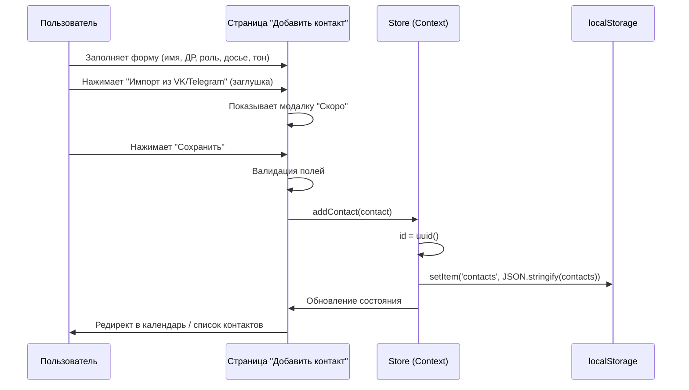

# Сиквенс: добавление контакта (досье)

```mermaid
sequenceDiagram
    participant U as Пользователь
    participant UI as Страница "Добавить контакт"
    participant Store as Store (Context)
    participant LS as localStorage

    U->>UI: Заполняет форму (имя, ДР, роль, досье, тон)
    U->>UI: Нажимает "Импорт из VK/Telegram" (заглушка)
    UI->>UI: Показывает модалку "Скоро"
    U->>UI: Нажимает "Сохранить"
    UI->>UI: Валидация полей
    UI->>Store: addContact(contact)
    Store->>Store: id = uuid()
    Store->>LS: setItem('contacts', JSON.stringify(contacts))
    Store->>UI: Обновление состояния
    UI->>U: Редирект в календарь / список контактов
```
