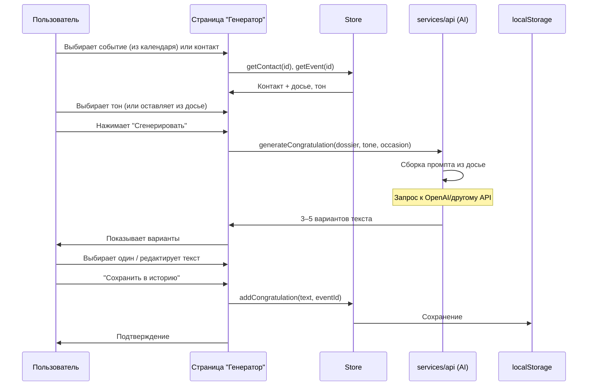

# Сиквенс: генерация поздравления

```mermaid
sequenceDiagram
    participant U as Пользователь
    participant UI as Страница "Генератор"
    participant Store as Store
    participant API as services/api (AI)
    participant LS as localStorage

    U->>UI: Выбирает событие (из календаря) или контакт
    UI->>Store: getContact(id), getEvent(id)
    Store->>UI: Контакт + досье, тон
    U->>UI: Выбирает тон (или оставляет из досье)
    U->>UI: Нажимает "Сгенерировать"
    UI->>API: generateCongratulation(dossier, tone, occasion)
    API->>API: Сборка промпта из досье
    Note over API: Запрос к OpenAI/другому API
    API->>UI: 3–5 вариантов текста
    UI->>U: Показывает варианты
    U->>UI: Выбирает один / редактирует текст
    U->>UI: "Сохранить в историю"
    UI->>Store: addCongratulation(text, eventId)
    Store->>LS: Сохранение
    UI->>U: Подтверждение
```
