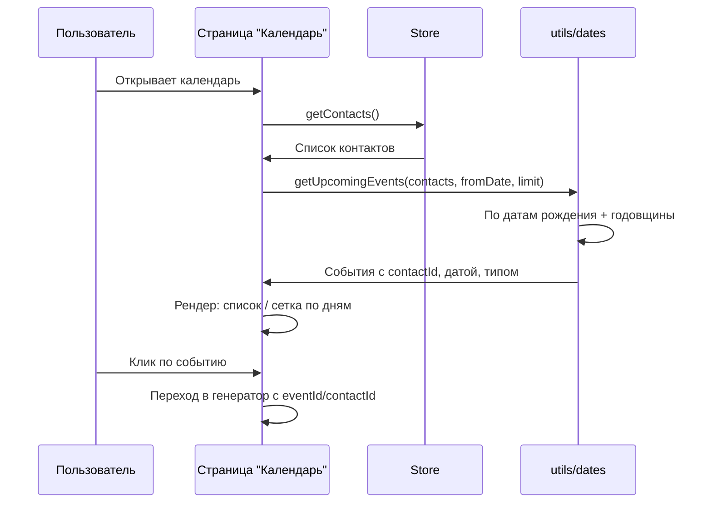

# Сиквенс: календарь и предстоящие события

```mermaid
sequenceDiagram
    participant U as Пользователь
    participant UI as Страница "Календарь"
    participant Store as Store
    participant Utils as utils/dates

    U->>UI: Открывает календарь
    UI->>Store: getContacts()
    Store->>UI: Список контактов
    UI->>Utils: getUpcomingEvents(contacts, fromDate, limit)
    Utils->>Utils: По датам рождения + годовщины
    Utils->>UI: События с contactId, датой, типом
    UI->>UI: Рендер: список / сетка по дням
    U->>UI: Клик по событию
    UI->>UI: Переход в генератор с eventId/contactId
```
