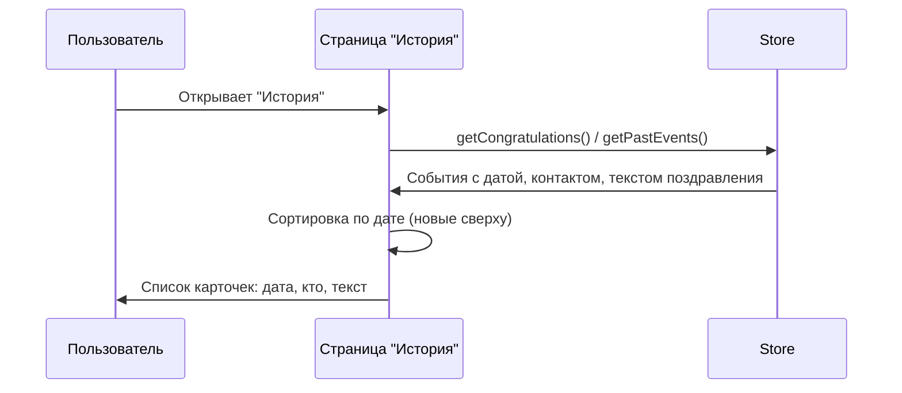

# Сиквенс: история прошедших событий

```mermaid
sequenceDiagram
    participant U as Пользователь
    participant UI as Страница "История"
    participant Store as Store

    U->>UI: Открывает "История"
    UI->>Store: getCongratulations() / getPastEvents()
    Store->>UI: События с датой, контактом, текстом поздравления
    UI->>UI: Сортировка по дате (новые сверху)
    UI->>U: Список карточек: дата, кто, текст
```
